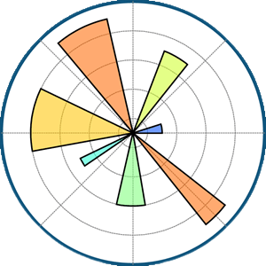

# Hi there! 👋 My name is James 

### Data Scientist | Machine Learning and Artificial Intelligence | Passionate about Tech | Creative Problem Solver.

I am a certified data professional with a passion for working with data. 🔭 As a Data Scientist, I am actively exploring data engineering while continuously expanding my expertise in the field. I bring strong coding and problem-solving skills, along with hands-on experience using the latest technologies.

Driven by a desire to succeed, I thrive in challenging environments and am committed to lifelong learning. My knowledge spans data science and machine learning, and I am eager to stay ahead of emerging trends.

An interesting fact about me is my competitive spirit, which fuels my love for basketball and tennis. ⚡

My career objective is to contribute to a progressive organization by leveraging my technical and creative skills to drive growth while staying at the forefront of innovation. 🌟
  

### *Let’s connect and collaborate on exciting data-driven projects. Together, we can achieve remarkable results!* 🚀🚀

<!--  <h3>Connect :</h3> -->

 

### Languages and Tools:

 
 
